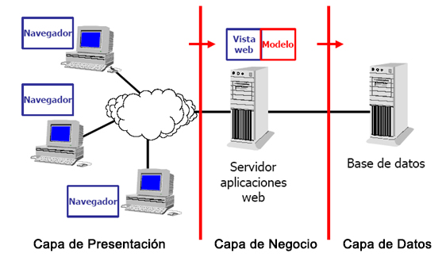
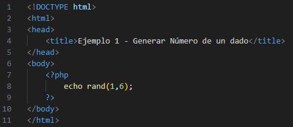
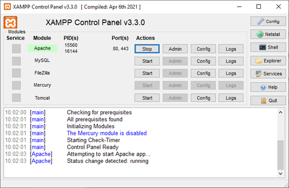
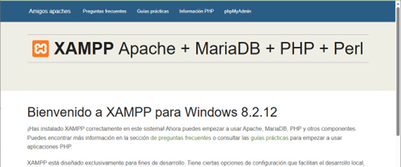
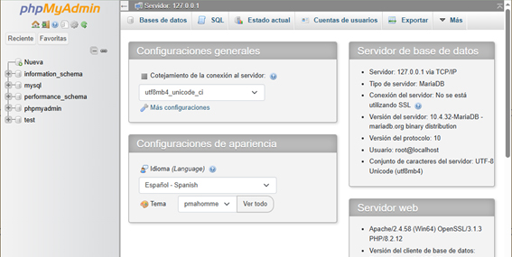
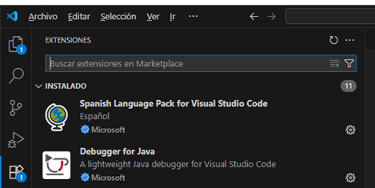

# UD1 - Introducción y Arquitectura de Aplicaciones Web

---

## 1.1. Modelos de programación en entorno cliente-servidor

Las aplicaciones web se basan en el **modelo cliente-servidor**: un modelo distribuido donde los servidores proveen servicios (información, recursos) y los clientes los solicitan.

- Es el **cliente** quien inicia siempre la comunicación enviando una solicitud
- El **servidor** responde con el recurso solicitado o con un mensaje de error
- La comunicación se realiza mediante **HTTP** (puerto 80) o **HTTPS** (puerto 443)
- Cliente y servidor suelen estar en máquinas diferentes conectadas por red, aunque pueden estar en el mismo equipo

En la web, el cliente es habitualmente un **navegador** que solicita páginas al servidor web.

---

### 1.1.1 Arquitectura a tres capas

Es una ampliación del modelo cliente-servidor que separa la aplicación en tres capas independientes:

| Capa | Función | Dónde se ejecuta |
|---|---|---|
| **Presentación** | Interfaz de usuario: muestra información y permite interactuar | Navegador (cliente) |
| **Negocio** | Lógica de la aplicación; se comunica con las otras dos capas | Servidor web |
| **Datos** | Gestión de la base de datos | Servidor de BD |

!!! warning "Comunicación entre capas"
    La capa de **presentación no se comunica directamente con la de datos**. Toda la comunicación pasa por la capa de negocio.

{ .center }

**Ejemplo — Login en una aplicación web:**

1. El navegador envía el formulario → **capa de presentación**
2. El servidor comprueba las credenciales contra la BD → **capa de negocio** consulta la **capa de datos**
3. Según la respuesta, se permite el acceso o se muestra un error → de vuelta a la **capa de presentación**

!!! note "Actividad 1"
    Pon un ejemplo del modelo a 3 capas describiendo lo que sucede en cada capa, similar al ejemplo del login anterior.

!!! note "Actividad 2"
    Visita la web del W3C ([www.w3.org](https://www.w3.org)) para ver la lista de sus estándares. Investiga qué es un **Estándar Web** (*Web Standard*) y qué es una **Recomendación** (*Recommendation*).

---

## 1.2. Generación dinámica de páginas web

Las páginas escritas solo en HTML son **páginas estáticas**: siempre muestran el mismo contenido. Cuando se usan lenguajes de programación en el servidor, el contenido puede generarse en función de la solicitud del cliente: son las **páginas web dinámicas**.

### 1.2.1 Opciones para ejecutar código en el servidor

- **Servidores de aplicaciones**: entornos específicos como Tomcat (Java), IIS (ASP.NET) o Node.js (JavaScript)
- **Servidores web tradicionales**: Apache o Nginx, configurados con módulos para ejecutar PHP, Python, etc.
- **Frameworks específicos**: Django (Python), Laravel (PHP), Ruby on Rails (Ruby)

### 1.2.2 Lenguajes de programación en entorno servidor

| Lenguaje | Frameworks / Entornos habituales |
|---|---|
| **Java** | Tomcat, JBoss, Spring |
| **PHP** | Apache, Nginx, Laravel, WordPress, Symfony |
| **JavaScript** | Node.js, Express.js |
| **Python** | Django, Flask, Pyramid |
| **Ruby** | Ruby on Rails |
| **C# (.NET)** | ASP.NET (servidores Windows) |

Algunos de los frameworks más utilizados:

- PHP → **Laravel**, Symfony
- Python → **Django**, Flask
- JavaScript → **Angular**, Node.js

!!! note "Actividad 3"
    Busca información sobre otros lenguajes de programación en el lado del servidor e indica para qué se recomiendan.

---

## 1.3. Integración con los lenguajes de marcas

Las páginas dinámicas combinan **código estático (HTML)** con **código dinámico** (PHP u otro lenguaje de servidor).

**Ejemplo — Número aleatorio con PHP:**

{ .center }

Al solicitar esta página, el servidor ejecuta el bloque PHP (líneas 7-9) y lo sustituye por su resultado. Si sale un 3, el cliente recibe:

```html linenums="1"
<!DOCTYPE html>
<html>
<head>
    <title>Ejemplo 1 - Generar Número de un dado</title>
</head>
<body> 3 </body>
</html>
```

!!! warning "Los archivos PHP deben tener extensión `.php`"
    Un archivo `.html` no ejecuta PHP porque PHP necesita ser interpretado por el servidor (Apache, Nginx...). Para que funcione, el archivo debe llamarse `.php`.

!!! note "Actividad 4"
    Busca e indica qué caracteres se utilizan para insertar código **ASP** y **JSP** dentro de páginas HTML.

---

## 1.4. Instalación del entorno de trabajo

Para las prácticas del curso necesitamos:

- Un **servidor web** → Apache (incluido en XAMPP)
- Un **servidor de base de datos** → MySQL/MariaDB (incluido en XAMPP)
- Un **editor de código** → Visual Studio Code

---

### 1.4.1 XAMPP

XAMPP es un paquete que incluye en una sola instalación:

| Componente | Función |
|---|---|
| **Apache** | Servidor web |
| **MySQL/MariaDB** | Sistema gestor de bases de datos |
| **PHP** | Lenguaje para desarrollo web |
| **phpMyAdmin** | Interfaz web para gestionar la BD |
| **Perl** | Lenguaje adicional (menos usado) |

Se usa para montar un **servidor local** en tu PC y probar aplicaciones web sin necesidad de un servidor externo.

#### Instalación en Windows

1. Descarga desde [https://www.apachefriends.org](https://www.apachefriends.org) → versión para Windows
2. Ejecuta el instalador `.exe`
3. En la selección de componentes, deja marcados: **Apache, MySQL, PHP y phpMyAdmin**
4. Carpeta de instalación: deja el valor por defecto `C:\xampp`
5. Al finalizar, marca *Iniciar Panel de Control de XAMPP*
{ .center }

#### Verificar la instalación

- **Apache**: lanza Apache desde el panel de control y accede a `http://localhost` → debe aparecer la página de bienvenida de XAMPP
{ .center }
- **MySQL**: arranca el servicio MySQL y accede a `http://localhost/phpmyadmin/` → debe aparecer la interfaz de phpMyAdmin
{ .center }
!!! note "Actividad 5"
    Realiza la instalación de XAMPP siguiendo los pasos indicados.

!!! note "Actividad 6"
    Accede a phpMyAdmin, crea una base de datos llamada `moviles` y crea una tabla `usuarios` con al menos los campos: `id`, `nombre`, `email`, `password`.

---

### 1.4.2 Visual Studio Code

VS Code es un editor de código gratuito y multiplataforma de Microsoft, ampliamente usado para desarrollo web (HTML, CSS, JavaScript, PHP, Python, Java...).

#### Instalación en Windows

1. Descarga desde [https://code.visualstudio.com](https://code.visualstudio.com)
2. Ejecuta el instalador `.exe`
3. En las opciones adicionales, se recomienda marcar:
    - *Add "Open with Code" action to Windows Explorer file context menu*
    - *Add "Open with Code" action to Windows Explorer directory context menu*
    - *Register Code as an editor for supported file types*
    - *Add to PATH*

#### Primeros pasos

- **Cambiar idioma**: `Ctrl+Shift+X` → busca *Spanish Language Pack for Visual Studio Code* → instala y reinicia
{ .center }
- **Extensiones por lenguaje**: instala desde el mismo panel de extensiones la extensión de PHP, Python, etc. según lo que vayas a programar

---

## Autoevaluación

!!! question "1. El W3C:"
    - a) Elabora servidores de aplicaciones
    - b) Elabora y mantiene estándares de tecnologías web
    - c) Elabora regulación de obligado cumplimiento para los desarrolladores

!!! question "2. El lenguaje básico para la elaboración de páginas web es:"
    - a) HTML
    - b) HTTP
    - c) HTTPS

!!! question "3. En el modelo a tres capas, la lógica de la interfaz gráfica se sitúa en la capa de:"
    - a) Presentación
    - b) Datos
    - c) Negocio

!!! question "4. En el modelo a tres capas, no hay comunicación directa entre:"
    - a) La capa de datos y la capa de negocio
    - b) La capa de presentación y la capa de negocio
    - c) La capa de datos y la capa de presentación

!!! question "5. En el modelo cliente-servidor, la comunicación la inicia:"
    - a) El cliente
    - b) El servidor
    - c) Cualquiera de los dos

!!! question "¿Cuál es el puerto asociado al protocolo HTTP?"
    - a) 553
    - b) 80
    - c) 21

!!! question "¿Cuál es el puerto asociado al protocolo HTTPS?"
    - a) 443
    - b) 80
    - c) 21

!!! question "XAMPP incluye:"
    - a) Servidor web y PHP
    - b) Servidor web, PHP y servidor de base de datos
    - c) Servidor de bases de datos y PHP

!!! question "¿Cuál de los siguientes no es un estándar del W3C?"
    - a) HTML
    - b) CGI
    - c) HTTP

!!! question "10. Un archivo `.html` ¿reconoce el código PHP?"
    - a) Sí, siempre
    - b) Directamente no, pero sí puede hacerlo si renombramos el archivo a `.php`
    - c) Ninguna es correcta
