# UD3 – Programación Web

## Formularios

A la hora de enviar un formulario, debemos tener claro cuándo usar **GET** o **POST**.

- **GET**: los parámetros se pasan en la URL (los podemos ver en la URL).
    - Máximo de 2048 caracteres y solo en ASCII.
    - Permite almacenar la dirección completa en el marcador o historial.
- **POST**: los parámetros se envían de manera oculta (aunque no encriptada).
    - Sin límite de datos, permite datos binarios.

Para los siguientes apartados, utilizaremos el siguiente ejemplo de formulario (recuerda incluir los archivos necesarios para utilizar Bootstrap en tu página):

```html
<form name="registro" method="get" action="miform.php">
  <div class="mb-3">
    <label for="nombre" class="form-label">Nombre</label>
    <input type="text" class="form-control" id="nombre"
           aria-describedby="nombreHelp" name="nombre" required>
  </div>
  <div class="mb-3">
    <label for="email" class="form-label">Email address</label>
    <input type="email" class="form-control" id="email"
           aria-describedby="emailHelp" required name="email">
    <div id="emailHelp" class="form-text">Nunca compartiremos tu email con nadie.</div>
  </div>
  <div class="mb-3">
    <label for="password" class="form-label">Password</label>
    <input type="password" class="form-control" id="password" name="password" required>
  </div>
  <button type="submit" class="btn btn-primary w-100" name="enviar">Enviar</button>
</form>
```

---

## $_GET

En nuestro primer ejemplo, vamos a ver cómo "viajan", y cómo se "reciben", los campos del formulario enviado a través del método GET.
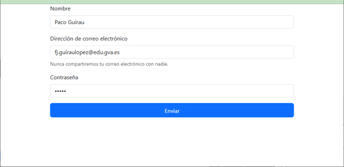{ .center }
Al pulsar en enviar, podemos ver cómo en la URL de destino aparecen los campos que hemos pasado con sus correspondientes valores:
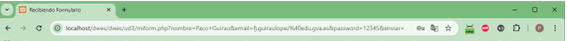{ .center }
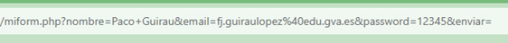{ .center }
```
/miform.php?nombre=Paco+Guirau&email=fj.guiraulopez%40edu.gva.es&password=12345&enviar=
```

Para recoger los datos, accedemos al array adecuado dependiendo del método del formulario:

```php
<?php
$par = $_GET["parametro_get"];
$par = $_POST["parametro_post"];
```

En este primer ejemplo hemos utilizado el método GET, así pues, en nuestro archivo `miform.php`, recogeremos los datos del formulario con el array `$_GET`:

```php
<?php
// El parámetro entre "" es el nombre dado al input en la página form_example.php
$nombre   = $_GET["nombre"];
$email    = $_GET["email"];
$password = $_GET["password"];
?>

<h1>Hola, <?= $nombre ?></h1>
<p>El email pasado es: <strong><?= $email ?></strong></p>
<p>Y la contraseña es: <strong><?= $password ?></strong></p>
```
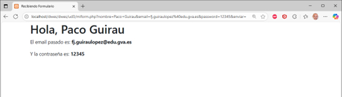{ .center }
---

## $_POST

Para utilizar el método POST, sólo debemos cambiar en el formulario inicial (`form_example.php`) el campo `method` y ponerlo a `post`:

```html
<form name="registro" method="post" action="miform.php">
  <div class="mb-3"> …
```

Y en la página donde recibimos los campos del formulario, debemos cambiar `$_GET` por `$_POST`:

```php
<?php
// El parámetro entre "" es el nombre dado al input en la página form_example.php
$nombre   = $_POST["nombre"];
$email    = $_POST["email"];
$password = $_POST["password"];
?>
```
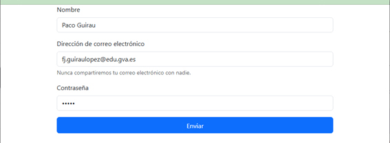{ .center }
Al pulsar en enviar, podemos ver cómo en la URL de destino ya **no** aparecen los campos que hemos pasado.
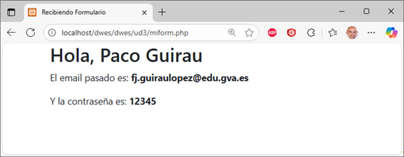{ .center }
---

## Validación

Para la validación, es muy importante implementar una **validación doble**:

- Por un lado, en el **cliente** mediante JavaScript.
- Por otro lado, en el **servidor**, antes de procesar la lógica de negocio, conviene volver a validar los datos por seguridad.

```php
<?php
if (isset($_GET["parametro_get"])) {
    $par = $_GET["parametro_get"];
    // comprobar si $par tiene el formato adecuado, su valor, etc...
}
```

En nuestro ejemplo ya hemos utilizado la implementación en el cliente, al usar un formulario HTML5 con campos del tipo específico de datos solicitado y con el atributo `required`.

Ahora vamos a pasar a implementar la validación en el servidor.

Antes de nada, utilizamos la función de PHP **`isset()`**, para verificar si una variable ha sido definida y no es `null`. Además, también podemos asegurarnos de que no esté en blanco con **`empty()`**. En nuestro código de ejemplo, modificamos el código de esta forma:

```php
if (isset($_POST["nombre"]) && !empty($_POST["nombre"])) {
    $nombre = $_POST["nombre"];
} else {
    echo "<div class='alert alert-error' role='alert'>❌ Error: Debe rellenar el campo nombre correctamente</div>";
    header("Refresh:5; url=form_example.php");
}
```

Así, si alguien intenta enviar nuestro formulario sin introducir un nombre, mostraría el mensaje de error y, tras 5 segundos, volvería a la página que contiene el formulario.

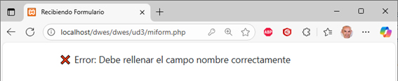{ .center }

### Validar el tipo de dato con `filter_input()`

Además de comprobar si un campo existe y no está vacío, PHP nos ofrece la función **`filter_input()`** para validar que el valor tiene el formato correcto según su tipo. Esto es especialmente útil para campos como emails, URLs o números enteros.

!!! warning "**¿Por qué no basta con el `type="email"` del HTML?**"
    La validación HTML5 solo ocurre en el navegador y cualquier usuario con conocimientos técnicos puede saltársela (por ejemplo, enviando la petición directamente con herramientas como Postman o curl). La validación en el servidor es imprescindible porque es la única que no puede evitarse.

```php
// Valida que el campo email tenga formato correcto
$email = filter_input(INPUT_POST, 'email', FILTER_VALIDATE_EMAIL);

if ($email === false || $email === null) {
    echo "<div class='alert alert-danger'>❌ Error: El email no tiene un formato válido.</div>";
    header("Refresh:5; url=form_example.php");
    exit;
}
```

Los filtros más habituales son:

| Filtro | Uso |
|---|---|
| `FILTER_VALIDATE_EMAIL` | Valida que sea un email correcto |
| `FILTER_VALIDATE_URL` | Valida que sea una URL correcta |
| `FILTER_VALIDATE_INT` | Valida que sea un número entero |
| `FILTER_VALIDATE_FLOAT` | Valida que sea un número decimal |
| `FILTER_SANITIZE_STRING` | Elimina etiquetas HTML del valor |

---

## Sanitizar datos introducidos por usuarios

Cualquier dato introducido en la página por los usuarios lo tenemos que considerar **poco seguro** y, por lo tanto, nunca debemos confiar en que no puede resultar en un ataque.

En PHP podemos usar mecanismos que nos aseguren que los datos volcados en la página son inofensivos; por ejemplo, convirtiendo cualquier valor de una cadena en sus caracteres especiales de HTML. Esto lo podemos hacer con la función **`htmlspecialchars()`**.

### Ataque XSS (Cross-Site Scripting)

Veamos primero el problema de estos ataques. Un usuario malintencionado podría introducir en el campo *Nombre* algo como:
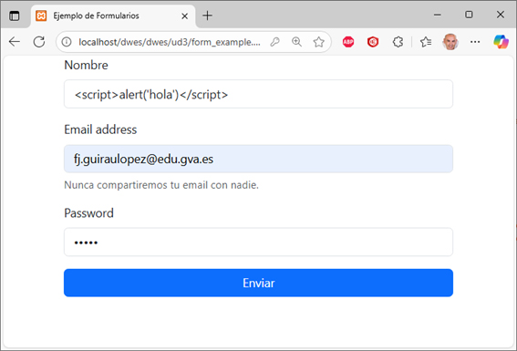{ .center }
```
<script>alert('hola')</script>
```

Sin protección, ese script se ejecutaría en el navegador de cualquier persona que visite la página. 
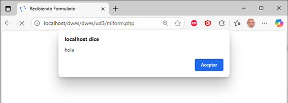{ .center }
Para solucionarlo, envolvemos la entrada del usuario con `htmlspecialchars()`:

```php
if (isset($_POST["nombre"]) && !empty($_POST["nombre"])) {
    $nombre = htmlspecialchars($_POST["nombre"]);
} else {
    echo "<div class='alert alert-error' role='alert'>❌ Error: Debe rellenar el campo nombre correctamente</div>";
    header("Refresh:5; url=form_example.php");
}
```

De este modo, si alguien escribe `<script>alert('hola')</script>`
{ .center }

La función `htmlspecialchars()` lo mostrará como:
```
&lt;script&gt;alert(&#039;hola&#039;)&lt;/script&gt;
```
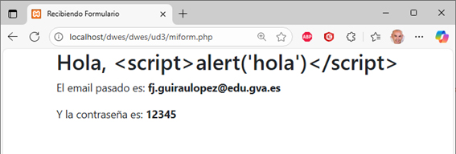{ .center }
Obtenemos así una respuesta libre de ejecución de código malicioso.

!!! info "**Resumen de cuándo usar cada función:**"
    - `htmlspecialchars()` → al **mostrar** datos en HTML (evita XSS en la salida).
    - `filter_input()` → al **recibir** datos del formulario (valida el formato y tipo).
    - Ambas son complementarias y deben usarse juntas.

---

## Prevenir ataques CSRF (Cross-Site Request Forgery)

**Falsificación de petición en sitios cruzados.**

La finalidad de estos ataques es que una página web maliciosa engañe al navegador del usuario para que envíe una petición a nuestra web sin que el usuario lo sepa. Por ejemplo, si el usuario tiene sesión iniciada en nuestro sitio, el atacante podría ejecutar acciones en su nombre.

### ⚠️ Solución incorrecta: comprobar el HTTP_REFERER

Una primera aproximación —que encontraréis en muchos ejemplos antiguos— es comprobar de dónde viene la petición:

```php
// ❌ NO usar esto en producción
if (parse_url($_SERVER['HTTP_REFERER'], PHP_URL_HOST) != $_SERVER['HTTP_HOST']) {
    die("Error: petición desde dominio externo.");
}
```

**¿Por qué no es suficiente?** Porque la cabecera `HTTP_REFERER` es enviada por el navegador del cliente, y puede estar ausente (muchos navegadores, proxies y extensiones de privacidad no la incluyen) o directamente falsificada. No es un mecanismo de seguridad fiable.

### ✅ Solución correcta: Token CSRF

El patrón estándar consiste en generar un **token secreto y aleatorio** en el servidor, incluirlo en el formulario como campo oculto, y verificarlo al recibir el envío. Un atacante externo no puede conocer este token porque nunca carga nuestra página directamente.

> **Nota:** Si ya habéis trabajado con Laravel en UD5, reconoceréis esto: la directiva `@csrf` de Blade hace exactamente esto de forma automática. Aquí lo implementamos a mano para entender qué hay detrás.

**Paso 1 — Generar el token en la página del formulario (`form_example.php`):**

```php
<?php
session_start();

// Generamos un token aleatorio y lo guardamos en sesión
if (empty($_SESSION['csrf_token'])) {
    $_SESSION['csrf_token'] = bin2hex(random_bytes(32));
}
?>

<form name="registro" method="post" action="miform.php">
  <!-- Campo oculto con el token -->
  <input type="hidden" name="csrf_token" value="<?= $_SESSION['csrf_token'] ?>">

  <div class="mb-3">
    <label for="nombre" class="form-label">Nombre</label>
    <input type="text" class="form-control" id="nombre" name="nombre" required>
  </div>
  <!-- ... resto del formulario ... -->
  <button type="submit" class="btn btn-primary w-100">Enviar</button>
</form>
```

**Paso 2 — Verificar el token en el procesador (`miform.php`):**

```php
<?php
session_start();

// Verificamos que el token existe y coincide con el guardado en sesión
if (
    !isset($_POST['csrf_token']) ||
    !isset($_SESSION['csrf_token']) ||
    $_POST['csrf_token'] !== $_SESSION['csrf_token']
) {
    echo "<div class='alert alert-danger'>❌ Error: petición no válida.</div>";
    header("Refresh:2; url=form_example.php");
    exit;
}

// Token correcto: procesamos el formulario con normalidad
$nombre = htmlspecialchars($_POST["nombre"]);
// ...
```

---

## Recoger datos de selección múltiple

En el caso de que tengamos algún campo con múltiples valores enviados (por ejemplo, una lista de selección múltiple o a través de checkboxes), el campo del formulario tendrá este aspecto:

Agregamos el atributo `multiple` al `<select>` y el atributo `name` debe terminar con `[]` (como un array):

```html
<select name="mis_opciones[]" multiple>
  <option value="valor1">Opción 1</option>
  <option value="valor2">Opción 2</option>
  <option value="valor3">Opción 3</option>
</select>
```

En PHP accedemos a la variable como un array y la recorremos con un bucle `foreach` para obtener cada valor seleccionado:

```php
$opciones_seleccionadas = $_POST['mis_opciones'];

foreach ($opciones_seleccionadas as $opcion) {
    echo "Opción seleccionada: " . $opcion . "<br>";
}
```

---

## Enviar archivos al servidor desde un formulario

Para poder enviar archivos a un servidor desde un formulario, añadimos un campo `<input>` de tipo `file`. Además, debemos añadir a la etiqueta `<form>` el atributo `enctype` con el valor `multipart/form-data` para hacer saber al navegador y al servidor que en ese formulario se van a enviar datos de un archivo:

```html
<form action="procesar.php" method="post" enctype="multipart/form-data">
  <input type="file" name="archivo">
  <input type="submit" value="Enviar">
</form>
```

Una vez recibido el formulario por el servidor, el fichero se almacena en una carpeta temporal y debemos moverlo a su ubicación definitiva con la función `move_uploaded_file()`. La variable global **`$_FILES`** contiene toda la información de los archivos que se han subido con el formulario.

### ⚠️ Validar el archivo antes de moverlo

Nunca debemos mover un archivo sin comprobar antes que es del tipo que esperamos. Un usuario malintencionado podría intentar subir un archivo `.php` y ejecutarlo en nuestro servidor.

> **Importante:** No uses `$_FILES['archivo']['type']` para validar el tipo. Ese valor lo envía el navegador del cliente y puede falsificarse fácilmente. Usa siempre **`mime_content_type()`**, que analiza el contenido real del archivo en el servidor.

```php
// Tipos de archivo que permitimos
$tipos_permitidos = ['image/jpeg', 'image/png', 'image/gif', 'application/pdf'];

// Obtenemos el tipo MIME real del archivo (no el que dice el navegador)
$tipo_real = mime_content_type($_FILES['archivo']['tmp_name']);

if (!in_array($tipo_real, $tipos_permitidos)) {
    echo "<div class='alert alert-danger'>❌ Error: tipo de archivo no permitido.</div>";
    exit;
}
```

### Generar nombres de archivo únicos

Si dos usuarios suben un archivo con el mismo nombre, el segundo sobrescribiría al primero. Para evitarlo, generamos un nombre único con `bin2hex(random_bytes(8))` y conservamos la extensión original:

```php
// Extraemos la extensión original del archivo
$extension = pathinfo($_FILES['archivo']['name'], PATHINFO_EXTENSION);

// Generamos un nombre único aleatorio
$nombre_unico = bin2hex(random_bytes(8)) . '.' . $extension;

$directorio_destino = "uploads/";
$nombre_archivo_temporal = $_FILES["archivo"]["tmp_name"];
$ruta_final = $directorio_destino . $nombre_unico;

if (move_uploaded_file($nombre_archivo_temporal, $ruta_final)) {
    echo "El archivo se ha subido correctamente como: " . $nombre_unico;
} else {
    echo "Error al subir el archivo.";
}
```

### Ejemplo completo con validación

```php
<?php
$tipos_permitidos = ['image/jpeg', 'image/png', 'image/gif', 'application/pdf'];

// 1. Validar tipo MIME real
$tipo_real = mime_content_type($_FILES['archivo']['tmp_name']);
if (!in_array($tipo_real, $tipos_permitidos)) {
    echo "<div class='alert alert-danger'>❌ Tipo de archivo no permitido.</div>";
    exit;
}

// 2. Generar nombre único
$extension = pathinfo($_FILES['archivo']['name'], PATHINFO_EXTENSION);
$nombre_unico = bin2hex(random_bytes(8)) . '.' . $extension;

// 3. Mover a su ubicación definitiva
$ruta_final = "uploads/" . $nombre_unico;
if (move_uploaded_file($_FILES['archivo']['tmp_name'], $ruta_final)) {
    echo "✅ Archivo subido correctamente.";
} else {
    echo "❌ Error al subir el archivo.";
}
?>
```

---

## Cookies

Las cookies en PHP son pequeños archivos de texto que se guardan en el navegador del usuario para almacenar datos y recordar información entre visitas. Se crean con la función **`setcookie()`** y se leen desde PHP a través de la variable superglobal **`$_COOKIE`**. Se usan comúnmente para identificar usuarios, almacenar preferencias o recordar datos como los artículos de un carrito de compras.

### Creación de una cookie

Se usa la función `setcookie()` para crear una cookie. En su forma básica recibe el nombre y el valor, pero en aplicaciones reales debemos usar siempre **las opciones de seguridad**:

```php
<?php
// ❌ Forma básica (sin opciones de seguridad): evitar en producción
setcookie("nombre_usuario", "Paco");

// ✅ Forma correcta con opciones de seguridad
setcookie("nombre_usuario", "Paco", [
    'expires'  => time() + (30 * 24 * 60 * 60), // caduca en 30 días
    'path'     => '/',                            // disponible en toda la web
    'secure'   => true,                           // solo se envía por HTTPS
    'httponly' => true,                           // no accesible desde JavaScript
    'samesite' => 'Strict'                        // protección adicional contra CSRF
]);
?>
```
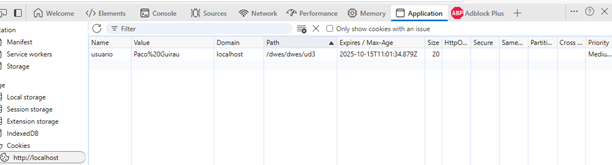{ .center }
!!! warning "**¿Por qué son importantes estas opciones?**"
    - **`httponly`**: impide que JavaScript pueda leer la cookie con `document.cookie`. Esto es fundamental porque, aunque usemos `htmlspecialchars()`, un XSS sofisticado podría robar las cookies de sesión del usuario. Con `httponly`, aunque el atacante logre ejecutar JS, no puede acceder a la cookie.
    - **`secure`**: garantiza que la cookie solo viaja cifrada por HTTPS, no por HTTP en claro.
    - **`samesite`**: controla desde qué sitios puede enviarse la cookie. Con `'Strict'`, el navegador solo la envía en peticiones que originen directamente en nuestra web, añadiendo una capa extra de protección contra CSRF.

### Cómo leer una cookie

Se accede al valor de una cookie a través del array superglobal `$_COOKIE`, utilizando el nombre de la cookie como índice:

```php
<?php
if (isset($_COOKIE["nombre_usuario"])) {
    // Sanitizamos igual que cualquier dato externo
    $usuario = htmlspecialchars($_COOKIE["nombre_usuario"]);
    echo "Hola, " . $usuario . "! Bienvenido de nuevo.";
} else {
    echo "Hola, invitado.";
}
?>
```

> **Nota:** Aunque la cookie la hayamos creado nosotros, al leerla debemos tratarla como cualquier dato externo y aplicar `htmlspecialchars()` antes de mostrarla en pantalla.

### Eliminar una cookie

Para eliminar una cookie, se utiliza la función `setcookie()` con el mismo nombre de la cookie, pero estableciendo la fecha de caducidad en el pasado y sin valor:

```php
<?php
setcookie("nombre_usuario", "", [
    'expires'  => time() - 3600, // fecha en el pasado
    'path'     => '/',
    'httponly' => true,
    'samesite' => 'Strict'
]);
?>
```

---

## Variables de Sesión

Las sesiones son otro mecanismo de intercambio de información entre navegador y servidor, cuyo tiempo de vida es igual a toda la visita de un usuario a una web (en cuanto el usuario cierra sesión, desconecta o cierra el navegador, se pierde la información).

Las principales diferencias entre las sesiones y las cookies son que **las sesiones no se almacenan en ficheros en el disco del cliente**, sino que se guarda un registro de ellas en el servidor. Cada cliente accede a su propia sesión a través de un identificador único —una clave alfanumérica— que se intercambian cliente y servidor en cada petición.

### ¿Cómo funcionan?

1. **Iniciar la sesión**: Se llama a la función `session_start()` al principio de cualquier script para iniciar o continuar una sesión (normalmente en todas las páginas del sitio web).
2. **Crear una cookie**: `session_start()` envía automáticamente una cookie al navegador del usuario con un ID único (`PHPSESSID`).
3. **Crear un archivo en el servidor**: El servidor crea un archivo (por ejemplo, `sess_e7hvo8s1j8dqsljdps1fo1uni5`) con este ID para almacenar las variables de sesión.
4. **Almacenar datos**: Para guardar datos, se usa la variable superglobal `$_SESSION`, que funciona como un array asociativo.
5. **Acceder a los datos**: En cualquier otra página del mismo sitio, al volver a llamar a `session_start()`, se puede acceder a los mismos datos a través de `$_SESSION`.

### Principales operaciones

```php
session_start();                    // inicia o carga la sesión
session_id();                       // obtiene el id (valor de PHPSESSID)
$_SESSION["clave"] = valor;         // asignamos valor a la sesión
session_destroy();                  // destruye la sesión
unset($_SESSION["clave"]);          // elimina una clave
```

### Protección contra Session Fixation

Existe un ataque llamado **Session Fixation** (fijación de sesión) en el que un atacante consigue que la víctima use un ID de sesión que él mismo conoce de antemano. Si la víctima se autentica con ese ID, el atacante puede acceder a su sesión.

La solución es muy sencilla: **regenerar el ID de sesión justo después de que el usuario se autentique correctamente**. De este modo, aunque el atacante conozca el ID anterior, el nuevo le será desconocido.

```php
<?php
session_start();

// El usuario envía usuario y contraseña...
if ($credenciales_correctas) {

    // ✅ Regeneramos el ID antes de guardar datos sensibles en sesión
    session_regenerate_id(true); // el parámetro true elimina la sesión antigua

    $_SESSION['usuario'] = $nombre_usuario;
    $_SESSION['rol']     = 'admin';
    header("Location: dashboard.php");
    exit;
}
?>
```

> **Nota:** Si ya habéis trabajado con Laravel en UD5, la autenticación con Breeze gestiona todo esto automáticamente. Aquí lo implementamos a mano para entender qué ocurre por debajo.

### Ejemplo de uso completo

```php
<?php
session_start();                              // arrancamos las variables de sesión
$_SESSION["ies"] = "IES Torrevigia";          // asignamos valor a la sesión ies
$instituto = $_SESSION["ies"];                // guardar valor de sesión en variable
echo "Estamos en el $instituto";
?>
```
