# UD4 – Acceso a Bases de Datos con PDO. Operaciones CRUD

## Acceso con PHP a bases de datos MySQL

A la hora de acceder con PHP a una base de datos MySQL, podemos hacerlo utilizando, entre otras formas, **MySQLi** y **PDO**. ¿Cuál utilizar?

- Usa **PDO** si necesitas portabilidad a otros sistemas de bases de datos.
- Usa **MySQLi** si solo trabajarás con MySQL, ya que ofrece una interfaz más moderna para interactuar específicamente con esta base de datos.

---

## Conexión a una base de datos con MySQLi

Antes de nada, vamos a crear una BD desde phpMyAdmin llamada `videojuegos`. Dentro de ella, creamos una tabla llamada `clientes` con los siguientes campos:

| Campo | Tipo | Restricciones |
|---|---|---|
| `id` | INT | Autoincremental, clave principal |
| `nombre` | VARCHAR | No nulo |
| `apellidos` | VARCHAR | No nulo |
| `email` | VARCHAR | No nulo, único |
| `password` | CHAR | No nulo |
| `genero` | CHAR(1) | M o F, no nulo |
| `direccion` | VARCHAR | No nulo |
| `codpostal` | CHAR(5) | No nulo |
| `poblacion` | VARCHAR | No nulo |
| `provincia` | VARCHAR | No nulo |
| `create_time` | TIMESTAMP | Valor predeterminado: `current_timestamp()` |


Una vez creada la BD y la tabla, establecemos la conexión con MySQLi en un archivo `pru.php`:

```php
<?php
$host     = "localhost";    // Dirección del servidor
$nombreBD = "videojuegos";  // Nombre de la BD
$usuario  = "root";         // Usuario con acceso a la BD
$password = "";             // Contraseña del usuario

// Crear conexión
$conn = new mysqli($host, $usuario, $password, $nombreBD);

// Verificar conexión
if ($conn->connect_error) {
    die("Conexión fallida - ERROR de conexión: " . $conn->connect_error);
}

print "Conexión OK";
?>
```

Al ejecutar este archivo en el servidor (con Apache y MySQL arrancados) debe aparecer el mensaje: **Conexión OK**.

Como estas líneas de conexión se repetirán en múltiples páginas, conviene definirlas en un archivo independiente. Creamos una carpeta llamada `db` en nuestro sitio web y dentro de ella un archivo `db.inc`:

```php
<?php
$host     = "localhost";
$nombreBD = "videojuegos";
$usuario  = "root";
$password = "";

// Crear conexión
$conn = new mysqli($host, $usuario, $password, $nombreBD);

// Verificar conexión
if ($conn->connect_error) {
    die("Conexión fallida - ERROR de conexión: " . $conn->connect_error);
}
?>
```

Y el archivo `pru.php` simplemente lo incluye:

```php
<?php
include("db/db.inc");
?>
```

---

## Conexión a una base de datos con PDO

Duplica el archivo `db.inc` y nómbralo `db_pdo.inc`. Modifica el código de la siguiente forma:

```php
<?php
$host     = "localhost";
$nombreBD = "videojuegos";
$usuario  = "root";
$password = "";
$dsn      = "mysql:host=$host;dbname=$nombreBD";

try {
    // Crear conexión
    $pdo = new PDO($dsn, $usuario, $password);
    echo "Conexión exitosa con PDO.";
} catch (\PDOException $e) {
    throw new \PDOException($e->getMessage(), (int)$e->getCode());
}
?>
```

Y `pru.php` pasa a incluir el nuevo archivo:

```php
<?php
include("db/db_pdo.inc");
?>
```

Comprueba que ahora recibes el mensaje: **Conexión Exitosa con PDO**.

---

## Preparación del BackEnd

### Tabla de usuarios

Para controlar el acceso al panel de administración, creamos una nueva tabla llamada `usuarios`:

| Campo | Tipo | Restricciones |
|---|---|---|
| `id` | INT | Autoincremental, clave principal |
| `email` | VARCHAR | No nulo, único |
| `password` | CHAR(40) | No nulo |
| `rol` | TINYINT | No nulo |
| `nombre` | VARCHAR | No nulo |
| `creado` | TIMESTAMP | Valor predeterminado: `current_timestamp()` |

Insertamos manualmente un usuario administrador: introducimos nuestro email, nuestro nombre y como `rol` asignamos el valor `1` (código de administrador). Para la contraseña, usamos un generador online de SHA1, copiamos el hash resultante y lo guardamos en el campo `password`. Los campos `id` y `creado` se generan automáticamente.

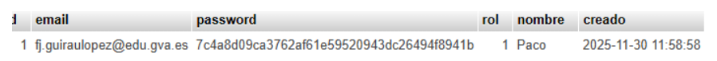{ .center }

### Estructura de carpetas

```
admin/
├── css/
├── clientes/
├── db/
│   ├── db.inc
│   └── db_pdo.inc
└── images/
```

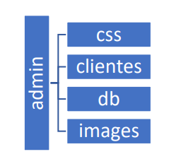{ .center }

### Login (index.php)

El punto de entrada al backend es `index.php`, con un formulario de email, contraseña y botón de acceso. El código de validación del login es:

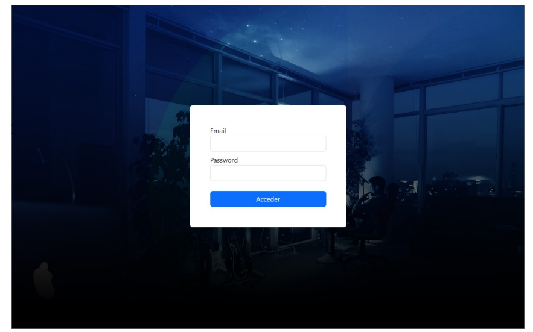{ .center }

```php
<?php
if (isset($_POST["email"]) && !empty($_POST["email"]) &&
    filter_var($_POST["email"], FILTER_VALIDATE_EMAIL)) {

    if (isset($_POST["password"]) && !empty($_POST["password"])) {

        $email    = htmlspecialchars(trim($_POST["email"]));
        $password = htmlspecialchars(sha1($_POST["password"]));

        $check = $conn->prepare(
            "SELECT nombre, email, rol FROM usuarios WHERE email = ? AND password = ?"
        );
        // bind_param evita inyecciones SQL
        // "ss" indica que ambos parámetros son strings
        $check->bind_param("ss", $email, $password);
        $check->execute();
        $check->store_result();

        if ($check->num_rows > 0) {
            // Credenciales válidas
            session_start();
            $check->bind_result($nombre, $emailDB, $rol);
            $check->fetch();

            $_SESSION["nombre"] = $nombre;
            $_SESSION["rol"]    = $rol;
            $_SESSION["email"]  = $emailDB;

            header("location:./clientes/gestion_clientes.php");
            die();

        } else {
            echo '<div class="alert alert-warning">⚠️ El email y la contraseña NO existen.</div>';
        }

    } else {
        echo '<div class="alert alert-warning">⚠️ Error en el campo Password.</div>';
    }

} else {
    if (isset($_POST["email"]))
        echo '<div class="alert alert-warning">⚠️ El email no es válido.</div>';
}
?>
```

---

## Operaciones CRUD con PHP y MySQL

Las operaciones **CRUD** hacen referencia a las cuatro funciones básicas de manipulación de bases de datos:

| Sigla | Operación | SQL |
|---|---|---|
| **C** | Create (Crear) | `INSERT` |
| **R** | Read (Leer) | `SELECT` |
| **U** | Update (Actualizar) | `UPDATE` |
| **D** | Delete (Eliminar) | `DELETE` |

---

## Mostrar los datos de los clientes (Read)

Creamos la página `gestion_clientes.php` dentro de `admin/clientes/`. Esta página muestra todos los clientes en una tabla Bootstrap:

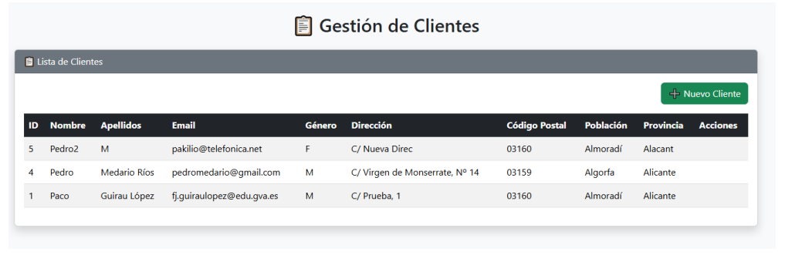{ .center }

```php title="gestion_clientes.php"
<?php
include("db/db_pdo.inc");

// Obtener todos los clientes
$clientes = $pdo->query("SELECT * FROM clientes ORDER BY id DESC")
                ->fetchAll(PDO::FETCH_ASSOC);
?>
<!DOCTYPE html>
<html lang="es">
<head>
  <meta charset="UTF-8">
  <title>Gestión de Clientes</title>
  <link href="https://cdn.jsdelivr.net/npm/bootstrap@5.3.3/dist/css/bootstrap.min.css" rel="stylesheet">
</head>
<body class="bg-light">
<div class="container mt-4">
  <h2 class="text-center mb-4">📋 Gestión de Clientes</h2>

  <div class="card shadow">
    <div class="card-header bg-secondary text-white">📋 Lista de Clientes</div>
    <div class="card-body">
      <div class="row mb-3 me-2 float-end">
        <a href="ins_cli_mysqli.php" class="btn btn-success">➕ Nuevo Cliente</a>
      </div>
      <table class="table table-striped table-hover align-middle">
        <thead class="table-dark">
          <tr>
            <th>ID</th><th>Nombre</th><th>Apellidos</th><th>Email</th>
            <th>Género</th><th>Dirección</th><th>Código Postal</th>
            <th>Población</th><th>Provincia</th><th>Acciones</th>
          </tr>
        </thead>
        <tbody>
          <?php foreach ($clientes as $c): ?>
          <tr>
            <td><?= $c['id'] ?></td>
            <td><?= htmlspecialchars($c['nombre']) ?></td>
            <td><?= htmlspecialchars($c['apellidos']) ?></td>
            <td><?= htmlspecialchars($c['email']) ?></td>
            <td><?= $c['genero'] ?></td>
            <td><?= htmlspecialchars($c['direccion']) ?></td>
            <td><?= $c['codpostal'] ?></td>
            <td><?= htmlspecialchars($c['poblacion']) ?></td>
            <td><?= htmlspecialchars($c['provincia']) ?></td>
          </tr>
          <?php endforeach; ?>
        </tbody>
      </table>
    </div>
  </div>
</div>
<script src="https://cdn.jsdelivr.net/npm/bootstrap@5.3.3/dist/js/bootstrap.bundle.min.js"></script>
</body>
</html>
```

!!! tip "Tarea"
    Realiza los cambios necesarios para que a esta página **solo se pueda acceder si el usuario ha iniciado sesión correctamente**. Modifica también el diseño añadiendo una barra lateral con un avatar, el nombre del usuario, su rol y un menú de navegación.

---

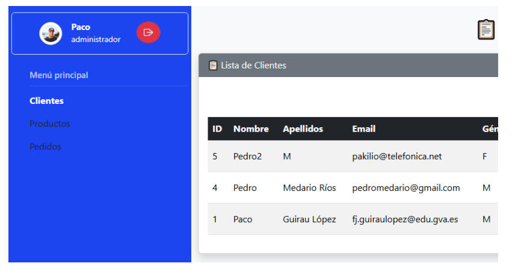{ .center }

## Insertar nuevos clientes (Create)

### Con MySQLi (`ins_cli_mysqli.php`)

Crea una página con un formulario de registro de cliente. 

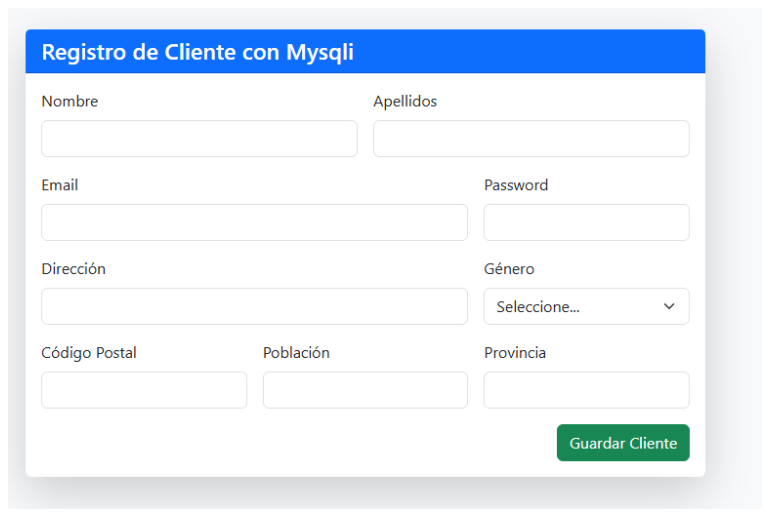{ .center }

Al pulsar *Guardar Cliente* y si todo funciona correctamente, los datos se insertarán en la base de datos.

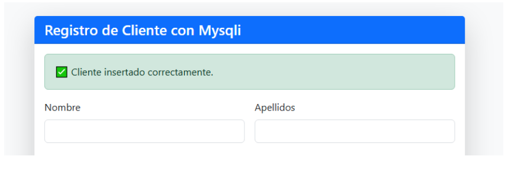{ .center }

### Con PDO (`ins_cli_pdo.php`)

Duplica la página anterior y cámbiala a `ins_cli_pdo.php`. Solo hay que sustituir el código MySQLi por su equivalente PDO. El fragmento clave es la verificación de email duplicado y la inserción:

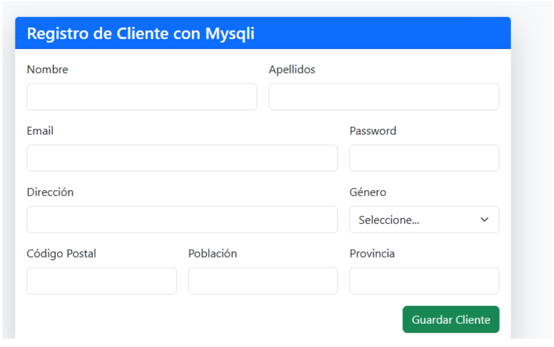{ .center }

```php
// Verificar duplicado de email
$check = $pdo->prepare("SELECT id FROM clientes WHERE email = ?");
$check->execute([$email]);

if ($check->rowCount() > 0) {
    echo '<div class="alert alert-warning">⚠️ El email ya existe en la base de datos.</div>';
} else {
    $sql = "INSERT INTO clientes (nombre, apellidos, email, genero, direccion, codpostal, poblacion, provincia)
            VALUES (?, ?, ?, ?, ?, ?, ?, ?)";
    $stmt = $pdo->prepare($sql);
    $stmt->execute([$nombre, $apellidos, $email, $genero, $direccion, $codpostal, $poblacion, $provincia]);
    echo '<div class="alert alert-success">✅ Cliente insertado correctamente.</div>';
}
```

Si se intenta insertar un email ya existente, se mostrará un mensaje de error, evitando que una persona se registre dos veces.

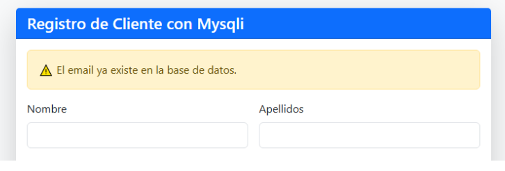{ .center }

---

## Eliminar un cliente (Delete)

En `gestion_clientes.php`, añadimos en el `foreach` una nueva columna `<td>` con el botón de eliminar, justo antes de cerrar `</tr>`:

```php
<td>
  <a href="?eliminar=<?= $c['id'] ?>" class="btn btn-danger btn-sm"
     onclick="return confirm('¿Eliminar cliente?');">🗑️</a>
</td>
```

Este enlace pasa el ID del cliente a eliminar en la variable `eliminar`. Al confirmar el diálogo, se ejecuta el siguiente código, que colocamos en la 3ª línea del programa, justo después de la conexión a la BD:

```php
// Eliminar cliente
if (isset($_GET['eliminar'])) {
    $id = intval($_GET['eliminar']);
    $pdo->prepare("DELETE FROM clientes WHERE id = ?")->execute([$id]);
    header("Location: gestion_cli.php");
    exit;
}
```

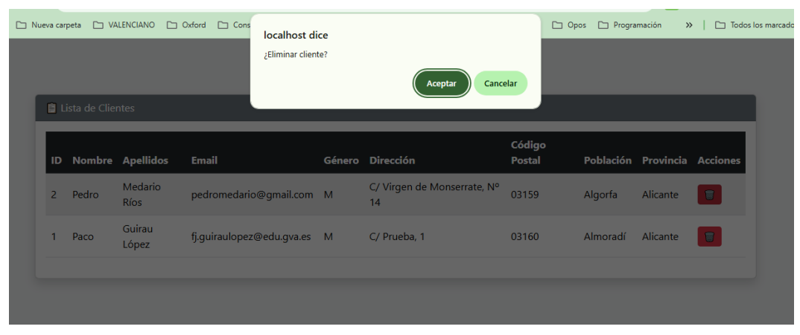{ .center }

---

## Actualizar datos de un cliente (Update)

### Botón de edición en la tabla

En la columna de acciones de `gestion_clientes.php`, añadimos el enlace al formulario de edición junto al botón de eliminar:

```php
<td>
  <a href="edit_cli.php?edit=<?= $c['id']; ?>" class="btn btn-sm btn-warning">✏️</a>
  <a href="?eliminar=<?= $c['id'] ?>" class="btn btn-danger btn-sm"
     onclick="return confirm('¿Eliminar cliente?');">🗑️</a>
</td>
```

### Página de edición (`edit_cli.php`)

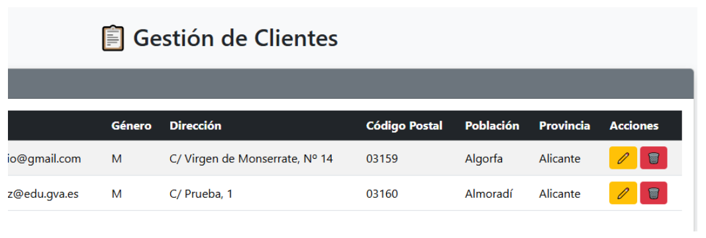{ .center }

Podemos reutilizar gran parte del código de `ins_cli_pdo.php`. La lógica es:

**1. Comprobar que existe la variable `edit`:**

```php
if (!isset($_GET["edit"])) {
    header("Location: gestion_cli.php");
    exit;
}
```

**2. Obtener los datos del cliente a editar:**

```php
$id    = intval($_GET["edit"]);
$check = $pdo->prepare("SELECT * FROM clientes WHERE id = ?");
$check->execute([$id]);

if ($check->rowCount() < 1) {
    header("Location: gestion_cli.php");
    exit;
}

// Obtenemos los datos en un array asociativo
$fila = $check->fetch(PDO::FETCH_ASSOC);
```

**3. Mostrar el formulario con los datos precargados:**

En el formulario usamos el array `$fila` para rellenar los campos, y añadimos dos campos ocultos —`accion` e `id`— para identificar la operación:

```php
<form method="POST" class="row g-3">
  <input type="hidden" name="accion" value="editar">
  <input type="hidden" name="id"     value="<?= $fila['id'] ?>">

  <div class="col-md-6">
    <label class="form-label">Nombre</label>
    <input type="text" name="nombre" class="form-control"
           value="<?= $fila['nombre'] ?>" required>
  </div>
  <!-- ... resto de campos igual ... -->
</form>
```

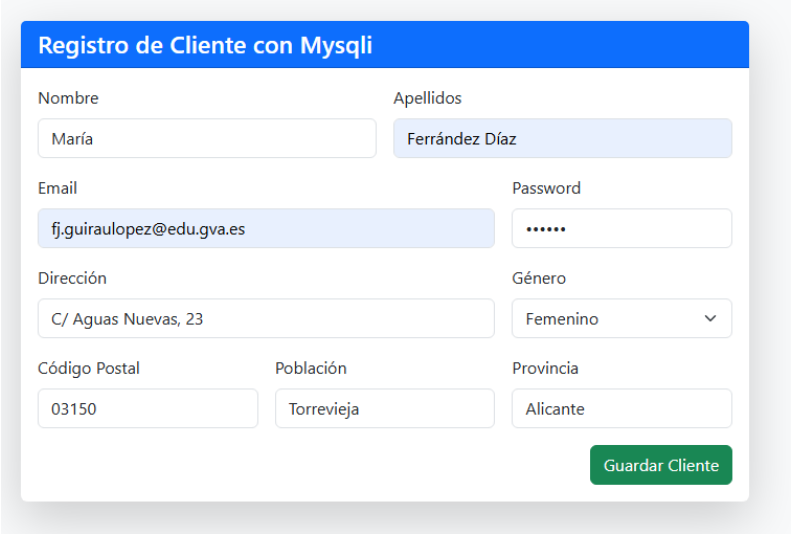{ .center }

**4. Procesar la actualización al enviar el formulario:**

Colocamos este código al inicio de la página, después de la conexión a la BD:

```php
if ($_SERVER["REQUEST_METHOD"] === "POST" &&
    isset($_POST['accion']) && $_POST['accion'] === 'editar') {

    $id        = intval($_POST['id']);
    $nombre    = trim($_POST['nombre']);
    $apellidos = trim($_POST['apellidos']);
    $email     = trim($_POST['email']);
    $genero    = trim($_POST['genero']);
    $direccion = trim($_POST['direccion']);
    $codpostal = trim($_POST['codpostal']);
    $poblacion = trim($_POST['poblacion']);
    $provincia = trim($_POST['provincia']);

    $sql  = "UPDATE clientes
             SET nombre=?, apellidos=?, email=?, genero=?,
                 direccion=?, codpostal=?, poblacion=?, provincia=?
             WHERE id=?";
    $stmt = $pdo->prepare($sql);
    $stmt->execute([
        $nombre, $apellidos, $email, $genero,
        $direccion, $codpostal, $poblacion, $provincia, $id
    ]);

    header("Location: gestion_cli.php");
    exit;
}
```

---

## Mejoras: modal de confirmación Bootstrap

En lugar del `confirm()` nativo del navegador, podemos usar una ventana modal de Bootstrap para confirmar la eliminación. Sustituimos el enlace de eliminar:

```php
<!-- Antes -->
<a href="?eliminar=<?= $c['id'] ?>" class="btn btn-danger btn-sm"
   onclick="return confirm('¿Eliminar cliente?');">🗑️</a>

<!-- Después -->
<button type="button" class="btn btn-danger"
        onclick="eliminarCliente(<?= $c['id']; ?>)">🗑️</button>
```

Añadimos el HTML del modal justo antes del cierre de `</body>`:

```html
<!-- Modal de confirmación -->
<div class="modal fade" id="confirmModal" tabindex="-1" aria-hidden="true">
  <div class="modal-dialog modal-dialog-centered">
    <div class="modal-content">
      <div class="modal-header bg-danger text-white">
        <h5 class="modal-title">Confirmar eliminación</h5>
        <button type="button" class="btn-close" data-bs-dismiss="modal"></button>
      </div>
      <div class="modal-body">
        ¿Seguro que deseas eliminar este cliente?
      </div>
      <div class="modal-footer">
        <button type="button" class="btn btn-secondary" data-bs-dismiss="modal">Cancelar</button>
        <button type="button" class="btn btn-danger" id="confirmDeleteBtn">Eliminar</button>
      </div>
    </div>
  </div>
</div>
```

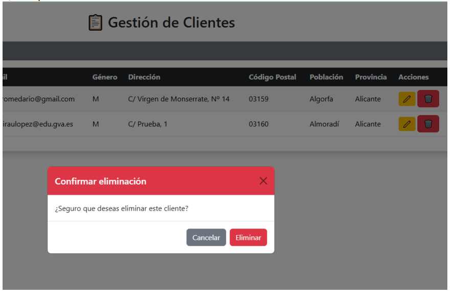{ .center }

Y el script que controla el modal, justo debajo:

```html
<script>
function eliminarCliente(numcliente) {
    const modal = new bootstrap.Modal(document.getElementById('confirmModal'));
    modal.show();

    document.getElementById('confirmDeleteBtn').onclick = () => {
        window.location.href = 'gestion_cli.php?eliminar=' + numcliente;
        modal.hide();
    };
}
</script>
```

!!! tip "Mejora propuesta"
    Investiga cómo mostrar un mensaje de alerta (o similar) en `gestion_cli.php` cuando los datos de un cliente sean actualizados correctamente.

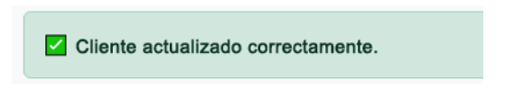{ .center }