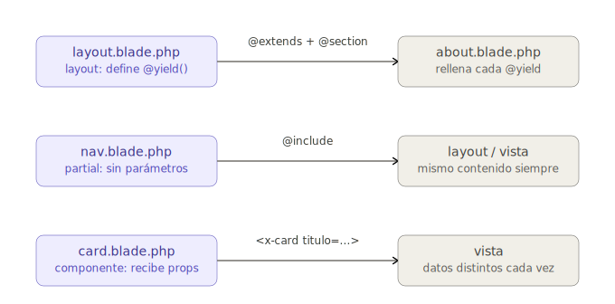

# UD5.1 – Framework Laravel: Vistas, Rutas, Layouts, Partials y Componentes

## 5.1.1. ¿Qué es un Framework?

!!! info "Analogía"
    Imagina que quieres construir una casa:

    - **Sin framework**: Tienes que fabricar los ladrillos, crear el cemento, diseñar la estructura...
    - **Con framework**: Ya tienes los ladrillos, el cemento, los planos y las herramientas listas. Solo tienes que montarlo todo.

Los frameworks permiten a los desarrolladores centrarse en la **lógica de negocio** de su aplicación, en lugar de tener que reinventar soluciones a problemas ya resueltos. Laravel sigue el patrón MVC, que veremos en el siguiente apartado.

### Ventajas de utilizar Frameworks

- **Ahorro de tiempo:** Muchas funcionalidades están ya implementadas.
- **Estructura y organización:** Facilita seguir patrones de diseño y mantener el código ordenado.
- **Seguridad:** Los frameworks integran mecanismos contra ataques comunes (inyección SQL, XSS, CSRF...).
- **Mantenibilidad:** Facilitan actualizaciones y extensiones futuras.
- **Comunidad y soporte:** Tienen documentación extensa y foros de ayuda.
- **Buenas prácticas:** Obligan a seguir patrones de programación profesionales.

### Inconvenientes de utilizar Frameworks

- **Curva de aprendizaje:** Al principio puede ser complicado entender su estructura y filosofía.
- **Sobrecarga:** En proyectos pequeños, puede ser demasiado pesado utilizar un framework grande.
- **Dependencia externa:** Si el framework deja de actualizarse o cambia mucho, puede afectar a nuestro proyecto.
- **Restricciones:** Nos obliga a adaptarnos a su forma de trabajar.

### ¿Por qué se ha elegido Laravel para este curso?

Laravel es actualmente uno de los frameworks más populares y recomendados para el desarrollo web en PHP:

- **Facilidad de uso:** Tiene una curva de aprendizaje razonable para principiantes.
- **Documentación excelente:** Muy bien documentado, con muchos tutoriales y recursos.
- **Moderno:** Sigue las últimas tendencias en desarrollo web (APIs REST, desarrollo frontend integrado, seguridad).
- **Rico en funcionalidades:** Sistema de rutas sencillo, ORM Eloquent, motor de plantillas Blade, autenticación, validación de formularios, colas de tareas, etc.
- **Gran comunidad:** Fácil encontrar ayuda, con muchas librerías y paquetes disponibles.
- **Escalabilidad:** Válido tanto para proyectos pequeños como para aplicaciones complejas.

!!! tip "Reflexión"
    Laravel no es solo un framework "de laboratorio" o "para practicar". Se utiliza en el **mundo real**, en aplicaciones de **millones de usuarios** y en **sistemas empresariales** críticos. Aprender Laravel abre la puerta a trabajar en proyectos profesionales de verdad.

---

## 5.1.2. Como crear y arrancar proyectos en Laravel

Para trabajar con Laravel necesitamos tener instalado el siguiente software:

1. **IDE** (entorno de desarrollo): usaremos Visual Studio Code, aunque existen alternativas como PHPStorm, Sublime Text, Atom, etc.
2. **Servidor web** que soporte PHP: usaremos Apache.
3. **Servidor de bases de datos**: usaremos MariaDB/MySQL.
4. **PHP** actualizado a una versión compatible con Laravel (p. ej., Laravel 9 requiere PHP 8.0 o posterior).
5. **Composer**: herramienta necesaria para instalar Laravel y sus dependencias.
6. **npm**: gestor de paquetes para dependencias del lado cliente (se instala con Node.js).
7. **Otras herramientas** opcionales, como un cliente REST para probar APIs.

En nuestro caso, todo el software está instalado en una máquina virtual con Lubuntu (usuario: `alumno`, contraseña: `alumno`).

### 5.1.2.1. Usando el comando `laravel`

Nos ubicamos en la carpeta donde queremos crear el proyecto y ejecutamos:

```bash
laravel new nombre_proyecto
```

Por ejemplo, para crear una web de libros:

```bash
laravel new biblioteca
```

El asistente nos hará varias preguntas:

- **Starter kit** → No
- **Testing framework** → PHPUnit (dejamos el predeterminado)
- **Repositorio Git** → No
- **Motor de base de datos** → MySQL

Esto creará una carpeta `biblioteca/` con el proyecto dentro.

### 5.1.2.2. Usando el comando `composer`

Alternativa recomendada si queremos una versión específica de Laravel o si el comando anterior falla:

```bash
composer create-project --prefer-dist laravel/laravel nombre_proyecto
```

Para nuestro ejemplo:

```bash
composer create-project --prefer-dist laravel/laravel biblioteca
```

Se creará la carpeta `biblioteca/` con la última versión de Laravel disponible, sin hacer preguntas de configuración.

### 5.1.2.3. El comando `artisan`

Cuando se crea un proyecto Laravel, se instala en la raíz del proyecto una herramienta llamada **artisan**, una CLI (*Command Line Interface*) que proporciona opciones adicionales para gestionar el proyecto: crear controladores, migrar datos, etc.

Para ver todas las opciones disponibles:

```bash
php artisan list
```

Para ver la versión de Laravel del proyecto:

```bash
php artisan --version
```

!!! tip
    Podemos abrir la carpeta del proyecto con Visual Studio Code y usar su terminal integrado (*Terminal > New Terminal*). Esto nos ubica automáticamente en la carpeta del proyecto.

### 5.1.2.4. Puesta en marcha con `artisan serve`

La forma más sencilla de probar el proyecto es con:

```bash
php artisan serve
```

Esto habilita un servidor local y muestra en el terminal la URL de acceso, normalmente:

```
Starting Laravel development server: http://127.0.0.1:8000
```

??? note "Permisos y despliegue en XAMPP (si lo necesitas)"
    ### 5.1.2.5. Permisos en carpetas del proyecto
      En sistemas Linux o Mac, si el proyecto se mueve a una carpeta con permisos reducidos, debemos habilitar escritura en:

    - `storage/` y sus subcarpetas (vistas compiladas, logs, etc.)
    - `bootstrap/cache/` (caché de archivos ya cargados)

        - sudo chmod -R 777 bootstrap/cache
        - sudo chmod -R 777 storage
        - sudo chmod -R 777 storage/logs

!!!note "Aviso de Seguridad"
    Esto es válido en nuestro entorno de pruebas, pero en un servidor real dar permisos 777 sería un problema de seguridad; lo correcto sería ajustar el propietario del grupo www-data
---

## 5.1.3. Estructura de un proyecto Laravel

Laravel sigue el patrón **MVC (Modelo - Vista - Controlador)**, que organiza el código separando responsabilidades:

- **Modelos (M):** Representan los datos y la lógica de negocio → `app/Models/`
- **Vistas (V):** Pantallas e interfaces que verá el usuario → `resources/views/`
- **Controladores (C):** Gestionan la lógica de la aplicación → `app/Http/Controllers/`
- **Rutas:** Definen cómo accede el usuario a cada funcionalidad → `routes/web.php`

### 5.1.3.1. Estructura del proyecto

**Elementos principales (MVC)**

| Carpeta/Archivo | Descripción |
|---|---|
| `app/Models/` | Modelos de la base de datos. Ej: `User.php`. |
| `resources/views/` | Plantillas Blade que generan el HTML. |
| `app/Http/Controllers/` | Lógica que maneja las peticiones HTTP. |
| `routes/web.php` | Archivo donde se definen las rutas para clientes web. |


??? note "Otras carpetas y arhivos importantes que veremos más adelante"
    **Otras carpetas y archivos importantes**

    | Carpeta/Archivo | Descripción |
    |---|---|
    | `app/` | Lógica de la aplicación: controladores, modelos, middleware. |
    | `bootstrap/` | Carga inicial de la aplicación. Incluye `app.php`. |
    | `config/` | Archivos de configuración: base de datos, correo, sesiones, etc. |
    | `database/` | Migraciones, seeders y fábricas de datos para pruebas. |
    | `public/` | Carpeta pública servida por el servidor web. Contiene `index.php`, CSS y JS públicos. |
    | `storage/` | Archivos generados automáticamente: logs, caché, ficheros temporales, subidas. |
    | `tests/` | Tests unitarios y funcionales. |
    | `.env` | Variables de entorno (configuraciones sensibles). |
    | `vendor/` | Dependencias del proyecto generadas por Composer. |
    | `artisan` | CLI de Laravel para tareas de desarrollo. |
    | `composer.json` | Define las dependencias PHP del proyecto. |

    **Dentro de `app/`**

    | Carpeta | Descripción |
    |---|---|
    | `Http/` | Controladores y middleware. |
    | `Models/` | Modelos de la base de datos. |
    | `Console/` | Comandos personalizados de Artisan. |

    **Dentro de `config/`**

    | Archivo | Descripción |
    |---|---|
    | `app.php` | Configuración general de la aplicación. |
    | `database.php` | Configuración de la base de datos. |
    | `mail.php` | Configuración del correo electrónico. |
    | `session.php` | Configuración de sesiones. |
    | `auth.php` | Configuración de autenticación. |

    **Dentro de `database/`**

    | Carpeta | Descripción |
    |---|---|
    | `migrations/` | Archivos que definen la estructura de las tablas. |
    | `seeders/` | Archivos para poblar la BD con datos iniciales. |
    | `factories/` | Archivos para crear datos de prueba para los modelos. |

    **Dentro de `storage/`**

    | Carpeta | Descripción |
    |---|---|
    | `app/` | Archivos subidos por los usuarios. |
    | `framework/` | Archivos generados automáticamente por Laravel. |
    | `logs/` | Archivos de registro de errores y eventos. |

    **Dentro de `public/`**

    | Archivo/Carpeta | Descripción |
    |---|---|
    | `css/` | Archivos CSS públicos. |
    | `js/` | Archivos JavaScript públicos. |
    | `index.php` | Punto de entrada a la aplicación. |
    | `favicon.ico` | Icono de la página web. |
    | `robots.txt` | Indica a los motores de búsqueda qué páginas indexar. |
    | `.htaccess` | Archivo de configuración de Apache. |

---

## 5.1.4. Clase Route en Laravel

Las rutas son el punto de entrada a nuestra aplicación. La clase `Route` define cómo responde la aplicación a las diferentes URLs.
Para entender bien el la rutas en laravel, debes saber que cuando llega una petición (el navegador pide una URL), Route actúa como el **recepcionista** que mira su lista, decide quién atiende esa petición (la función o, más adelante, el controlador) y qué le entrega de vuelta (un texto, una vista, etc.).

En Laravel, hay dos grandes tipos de rutas:

- **Rutas web:** Se definen en `routes/web.php` y manejan peticiones de navegadores tradicionales.
- **Rutas API:** Se definen en `routes/api.php` y están pensadas para clientes REST (apps móviles, servicios externos).

!!! warning "Rutas API en Laravel 12"
    A partir de la versión 12 de Laravel, el fichero `routes/api.php` **no se instala por defecto**. En el tema correspondiente a APIs REST veremos cómo crear la estructura necesaria para trabajar con ellas.

El archivo `routes/web.php` ya incluye una ruta predefinida hacia la raíz del proyecto:

```php
<?php

use Illuminate\Support\Facades\Route;

Route::get('/', function() {
    return view('welcome');
});
```

Para definir una ruta se llama a un método estático de la clase `Route`. El primer parámetro es la URL y el segundo es la función que se ejecutará cuando un cliente acceda a esa ruta.

### 5.1.4.1. Rutas simples

Las rutas simples tienen una URL fija y una función de respuesta:

```php
// Muestra la fecha y hora actuales al acceder a /fecha
Route::get('fecha', function() {
    return date("d/m/y h:i:s");
});

// Devuelve la vista home al acceder a /home
Route::get('/home', function () {
    return view('home');
});
```

!!! info
    El nombre del archivo de vista se indica sin la extensión `.blade.php`. Laravel la añade automáticamente.

### 5.1.4.2. Rutas con parámetros

Es posible pasar parámetros en la URL incluyendo su nombre entre llaves:

```php
// Parámetro obligatorio
Route::get('saludo/{nombre}', function($nombre) {
    return "Hola, " . $nombre;
});

// Parámetro opcional (con valor por defecto)
Route::get('saludo/{nombre?}', function($nombre = "Invitado") {
    return "Hola, " . $nombre;
});
```

Si el parámetro es obligatorio y no se indica en la URL, Laravel redirige a una página de error 404.

### 5.1.4.3. Rutas con nombre (*named routes*)

Podemos asociar un nombre a una ruta con el método `name()`. Esto es especialmente útil para enlaces, ya que si la URL cambia en el futuro solo hay que modificarla en un lugar:

```php
Route::get('contacto', function() {
    return "Página de contacto";
})->name('ruta_contacto');
```

Para usar la ruta nombrada en una vista Blade, usamos la función `route()`:

```html
<!-- En lugar de: -->
<a href="/contacto">Contacto</a>

<!-- Usamos: -->
<a href="{{ route('ruta_contacto') }}">Contacto</a>
```

### 5.1.4.4. El método `Route::view()`

Para rutas que solo muestran una vista estática sin lógica adicional, podemos usar este método más conciso:

```php
Route::view('/', 'welcome');
```

Es equivalente a `Route::get('/', function() { return view('welcome'); })` pero más simple.

### 5.1.4.5. Poner en práctica lo aprendido

Creamos dos vistas estáticas en `resources/views/landing/`:

```
resources/views/
└── landing/
    ├── index.blade.php
    └── about.blade.php
```

Contenido de cada archivo:

```html
<!-- index.blade.php -->
<h1>Bienvenido a nuestra página principal</h1>

<!-- about.blade.php -->
<h1>Sobre nosotros</h1>
```

Y en `routes/web.php`:

```php
Route::view('/', 'landing.index')->name('index');
Route::view('/about', 'landing.about')->name('about');
```

!!! info "Separador de carpetas en las vistas"
    Laravel usa el **punto** (`.`) como separador de carpetas al referenciar vistas. Por tanto:

    - `index.blade.php` → se referencia como `index`
    - `landing/index.blade.php` → se referencia como `landing.index`

---

## 5.1.5. Crear vistas en Laravel y uso de Blade

**Blade** es el motor de plantillas incluido en Laravel. No impide usar PHP puro en las plantillas, y todas las plantillas Blade se compilan en PHP y se almacenan en caché, por lo que prácticamente no añade sobrecarga.

Los archivos de plantilla Blade usan la extensión `.blade.php` y se almacenan en `resources/views/`.

**Ventajas principales de Blade:**

- Permite reutilizar código con layouts y partials.
- Tiene una sintaxis muy clara y elegante.
- Es más rápido y organizado que escribir HTML puro.
- Permite incluir recursos estáticos (CSS, imágenes) fácilmente.

### 5.1.5.1. Creación de páginas HTML completas

Creamos un nuevo proyecto llamado `ej_vistas` y dentro de `resources/views/landing/` creamos 4 páginas básicas:

```
resources/views/
└── landing/
    ├── index.blade.php
    ├── about.blade.php
    ├── services.blade.php
    └── contact.blade.php
```

Todas siguen la misma estructura; solo cambia el título y el contenido:

```html
<!DOCTYPE html>
<html lang="es">
<head>
  <meta charset="UTF-8">
  <title>Inicio</title>
</head>
<body>
  <header>
    <h1>Bienvenido a nuestra web</h1>
  </header>
  <main>
    <p>Esta es la página de inicio.</p>
  </main>
  <footer>
    <p>Pie de página &copy; 2025</p>
  </footer>
</body>
</html>
```

Para el resto de páginas, solo cambia el texto:

| Archivo | `<title>` | `<h1>` | `<p>` del `<main>` |
|---|---|---|---|
| `about.blade.php` | Sobre nosotros | Sobre nosotros | Información sobre nuestra empresa. |
| `services.blade.php` | Servicios | Servicios | Descripción de nuestros servicios. |
| `contact.blade.php` | Contacto | Contacto | Formulario de contacto. |

### 5.1.5.2. Definir las rutas

En `routes/web.php` definimos las rutas usando `Route::view()`:

```php
Route::view('/', 'landing.index')->name('home');
Route::view('/about', 'landing.about')->name('about');
Route::view('/services', 'landing.services')->name('services');
Route::view('/contact', 'landing.contact')->name('contact');
```

### 5.1.5.3. Creación de un Layout base

Todas las páginas comparten más del 90% de su estructura HTML. Con Blade podemos crear un **layout** base reutilizable.

!!! tip "Ventaja de los layouts"
    Con un layout, si quieres cambiar la estructura común (cabecera, pie de página), solo tienes que hacerlo en un único archivo. Por ejemplo, para cambiar el pie de página basta con modificar el layout y se reflejará en todas las páginas.

Creamos la carpeta `resources/views/landing/layouts/` y dentro el archivo `landing.blade.php`:

```html
<!DOCTYPE html>
<html lang="es">
<head>
  <meta charset="UTF-8">
  <title>
    @yield('title')
  </title>
</head>
<body>
  <header>
    @yield('header')
  </header>
  <main>
    @yield('content')
  </main>
  <footer>
    <p>Pie de página &copy; 2025</p>
  </footer>
</body>
</html>
```

`@yield('nombre')` es un **marcador de posición** que se reemplazará por el contenido de la sección correspondiente en cada vista que extienda este layout.

Ahora modificamos las vistas para que extiendan el layout con `@extends` y definan sus secciones con `@section`:

```php title="index.blade.php"
    @extends('landing.layouts.landing')

    @section('title', 'Inicio')

    @section('header')
      <h1>Bienvenido a nuestra web</h1>
    @endsection

    @section('content')
      <p>Esta es la página de inicio.</p>
    @endsection
```    

```php title="about.blade.php"
    @extends('landing.layouts.landing')

    @section('title', 'Sobre Nosotros')

    @section('header')
      <h1>Sobre Nosotros</h1>
    @endsection

    @section('content')
      <p>Información sobre nuestra empresa.</p>
    @endsection
```

```php title="services.blade.php"
    @extends('landing.layouts.landing')

    @section('title', 'Servicios')

    @section('header')
      <h1>Servicios</h1>
    @endsection

    @section('content')
      <p>Descripción de nuestros servicios.</p>
    @endsection
```

```php title="contact.blade.php"
    @extends('landing.layouts.landing')

    @section('title', 'Contacto')

    @section('header')
      <h1>Contacto</h1>
    @endsection

    @section('content')
      <p>Formulario de contacto.</p>
    @endsection
```

### 5.1.5.4. Añadir menú de navegación

Añadimos el menú al layout, de modo que aparezca en todas las páginas sin duplicar código. La forma correcta es usar los nombres de ruta con `{{ route() }}` en lugar de URLs hardcodeadas:

```html
<header>
  <nav>
    <ul>
      <li><a href="{{ route('home') }}">Inicio</a></li>
      <li><a href="{{ route('about') }}">Sobre nosotros</a></li>
      <li><a href="{{ route('services') }}">Servicios</a></li>
      <li><a href="{{ route('contact') }}">Contacto</a></li>
    </ul>
  </nav>
  @yield('header')
</header>
```

!!! warning "Rutas hardcodeadas vs. nombradas"
    Usar `href="/about"` funciona, pero si algún día cambiamos la URL habría que actualizarla en todas las vistas. Con `{{ route('about') }}` solo hay que cambiarla en `routes/web.php`.

### 5.1.5.5. Uso de Partials

Si tenemos más de un layout, el menú se repetiría en todos ellos. Para evitarlo, Blade permite crear **partials**: fragmentos de código reutilizables que podemos incluir donde los necesitemos.

Creamos el archivo `resources/views/_partials/nav.blade.php` y movemos ahí el contenido del menú:

```html
<nav>
  <ul>
    <li><a href="{{ route('home') }}">Inicio</a></li>
    <li><a href="{{ route('about') }}">Sobre nosotros</a></li>
    <li><a href="{{ route('services') }}">Servicios</a></li>
    <li><a href="{{ route('contact') }}">Contacto</a></li>
  </ul>
</nav>
```

Y en el layout lo incluimos con `@include`:

```php
<header>
  @include('_partials.nav')
  @yield('header')
</header>
```

### 5.1.5.6. Componentes

Vamos a mejorar la página de servicios usando **componentes** Blade, que son bloques de código reutilizables con sus propias propiedades.

Los componentes se crean en `resources/views/components/`. Creamos `card.blade.php`:

```html title="card.blade.php"
@props(['titulo', 'contenido'])

<div class="card">
  @isset($titulo)
    <h2>{{ $titulo }}</h2>
  @endisset

  @isset($contenido)
    <p>{{ $contenido }}</p>
  @endisset
</div>
```

Ahora en `services.blade.php` usamos el componente con la sintaxis `<x-nombre-componente>`:

```php title="services.blade.php"
@extends('landing.layouts.landing')

@section('title', 'Servicios')

@section('header')
  <h1>Servicios</h1>
@endsection

@section('content')
  <x-card titulo="Servicio 1" contenido="Descripción breve del servicio 1."></x-card>
  <x-card titulo="Servicio 2" contenido="Descripción breve del servicio 2."></x-card>
  <x-card titulo="Servicio 3" contenido="Descripción breve del servicio 3."></x-card>
@endsection
```

### 5.1.5.7. Incluir recursos estáticos (assets)

Creamos la carpeta `public/assets/images/` y copiamos ahí una imagen (por ejemplo, `servicios.png`). Para referenciarla usamos la función **`asset()`**, que genera la URL correcta independientemente de donde esté desplegada la aplicación:

{ .center }

```html
@props(['titulo', 'contenido'])

<div class="card">
  @isset($titulo)
    <h2>{{ $titulo }}</h2>
  @endisset

  

  @isset($contenido)
    <p>{{ $contenido }}</p>
  @endisset
</div>
```

#### Incluir archivos CSS

Creamos `public/assets/css/style.css` y lo enlazamos en el layout:

```html
<!-- En el <head> de landing.blade.php -->
<link rel="stylesheet" href="{{ asset('assets/css/style.css') }}">
```

Contenido de `style.css`:

```css title="style.css"
body {
  font-family: Arial, sans-serif;
  background-color: #f4f4f4;
}

h1 { color: darkblue; }
h2 { color: #333; }
p  { color: #666; }

.card {
  border: 1px solid #ccc;
  padding: 15px;
  margin: 10px;
  display: inline-block;
  width: 200px;
}

nav ul {
  display: flex;
  gap: 20px;
  list-style: none;
}

nav a {
  text-decoration: none;
  font-weight: bold;
}
```

---

## Resumen

{ .center }
!!! note "Components, Partials y Layouts"
    - El **`layout`** tiene "huecos" **(@yield)** que cada vista rellena con **@section**; 
    - El **`partial`** es un trozo de código fijo que se inserta igual en cualquier sitio (**@include**, sin parámetros); 
    - El **componente** es como un partial pero "configurable", recibe datos distintos cada vez que se usa **(<x-card titulo="..." contenido="...">**)

En este tema hemos aprendido a:

- Crear **vistas** en Blade.
- Reutilizar código con **layouts** y **partials**.
- Crear **componentes** para código repetitivo.
- Incluir **imágenes** y **CSS** usando la función `asset()`.

Con estas bases estamos preparados para empezar a trabajar en proyectos más complejos usando Laravel y Blade de forma profesional.
